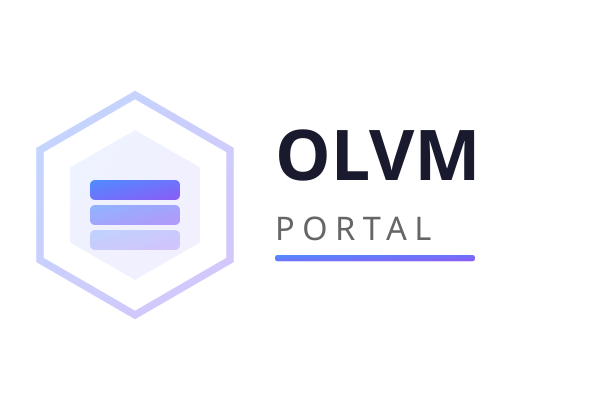
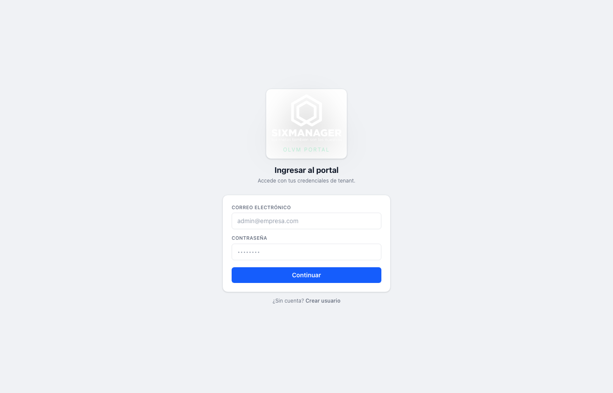
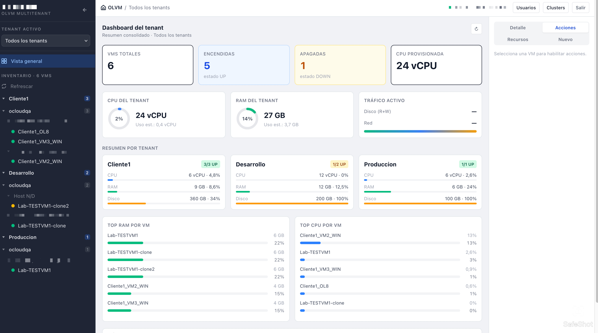
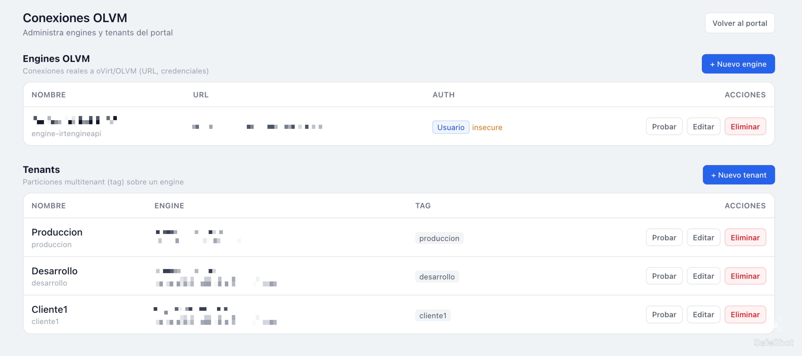
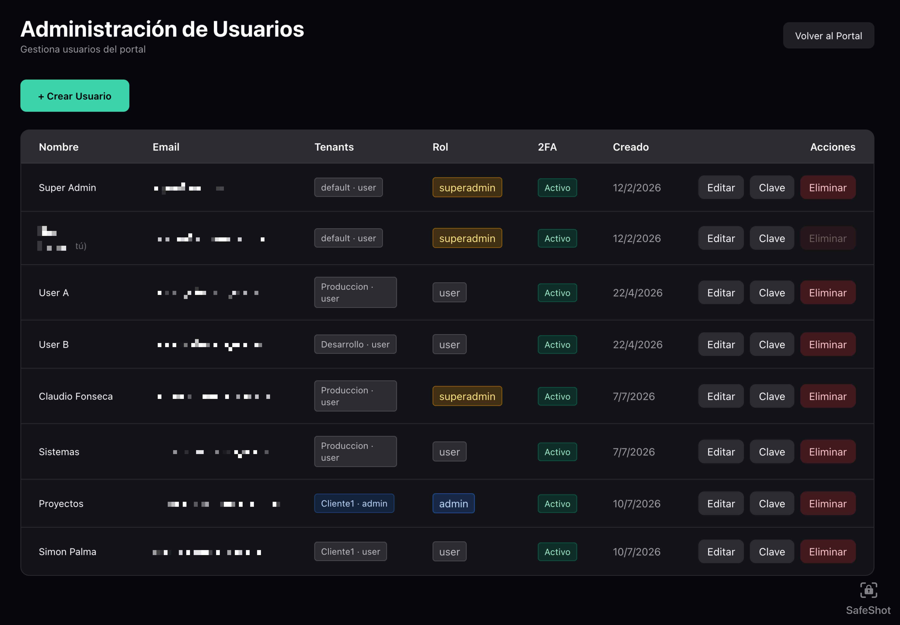

<p align="center">
  
</p>

# 🖥️ OLVM Portal

**Plataforma de administración multitenant para OLVM / oVirt**

Portal web self-service que permite gestionar máquinas virtuales, storage domains, ISOs y usuarios sobre motores OLVM/oVirt, con aislamiento por tenant y control de acceso basado en roles.

---

## 📸 Capturas

| Vista | Imagen |
|-------|--------|
| Login + 2FA |  |
| Dashboard |  |
| Gestión de VMs |  |
| Admin Tenants |  |
| Admin Usuarios |  |

## ✨ Características

### 📊 Dashboard Inteligente
- Métricas en tiempo real: CPU, RAM y almacenamiento por tenant
- Vista global "Todos los tenants" con tarjetas resumidas
- Donut charts y barras de uso por storage domain

### 🖥️ Gestión de VMs
- **Crear VMs** con selector de OS (Linux/Windows) que ajusta el hardware automáticamente
- **Ciclo de vida completo**: start, stop, shutdown, reboot, clonar, eliminar
- **Discos**: crear con interfaz VirtIO/SATA/IDE, eliminar, ver detalles
- **Recursos**: editar RAM y vCPU en caliente
- **Consola**: VNC embebida en el navegador + descarga de archivo `.vv`

### 💿 Storage Domains
- Asignación de SDs por tenant (filtrado de visibilidad)
- **SDs compartidos** por engine (ej: repositorio de ISOs visible para todos)
- Métricas correctas de espacio (available / used / total)

### 📀 Gestión de ISOs
- **Subir ISOs** al storage domain desde el portal (hasta 10GB, upload por chunks con barra de progreso)
- Montar/desmontar ISO en VMs (CD-ROM)
- Listado automático con refresh al abrir el dropdown
- Validación anti-duplicados

### 🔐 Instalación de Sistemas Operativos
- Flujo completo: crear VM → agregar disco → montar ISO → **encender desde CD** → instalar via consola
- Selector de OS define la interfaz de disco óptima (SATA para Windows, VirtIO para Linux)

### 👥 Multitenant & Seguridad
- **Engines separados de Tenants**: un engine sirve a N tenants sin duplicar credenciales
- **Tags de OLVM** para filtrado automático de VMs por tenant
- **Roles**: superadmin (global), admin/user (por tenant)
- **Memberships multi-tenant**: un usuario puede pertenecer a varios tenants
- **2FA** obligatorio vía email (Resend)
- Middleware que bloquea acceso cross-tenant

### ⚙️ Administración
- CRUD de Engines (URL, credenciales, CA cert, test de conexión, SDs compartidos)
- CRUD de Tenants (engine, tag, storage domains asignados)
- CRUD de Usuarios (memberships, 2FA, default tenant, reset password)

---

## 🛠️ Stack Tecnológico

| Capa | Tecnología |
|------|-----------|
| **Framework** | Next.js 16 (App Router, SSR) |
| **Lenguaje** | TypeScript |
| **UI** | React 19, Tailwind CSS |
| **Auth** | NextAuth.js (JWT + 2FA) |
| **2FA** | Resend (email OTP) |
| **Virtualización** | noVNC (consola embebida) |
| **API OLVM** | oVirt REST API v4 |
| **Runtime** | Node.js 22 |
| **Deploy** | Docker (standalone) |

---

## 🏗️ Arquitectura

```
┌──────────────────────────────────────────────────┐
│                   Browser (Cliente)                │
│  ┌──────────┐  ┌──────────┐  ┌─────────────────┐  │
│  │ Dashboard │  │ VM Panel │  │ Consola noVNC   │  │
│  └─────┬─────┘  └─────┬────┘  └────────┬────────┘  │
└────────┼──────────────┼───────────────┼───────────┘
         │              │               │
┌────────▼──────────────▼───────────────▼───────────┐
│              Next.js 16 (Server)                    │
│  ┌──────────┐  ┌──────────┐  ┌─────────────────┐  │
│  │ API Routes│  │ Auth/JWT │  │ WS Proxy (3010) │  │
│  └─────┬─────┘  └──────────┘  └─────────────────┘  │
│  ┌─────▼─────────────────────────────────────────┐ │
│  │  engineStore / clusterStore / userStore       │ │
│  │  (JSON file-based, seeding desde env vars)     │ │
│  └─────┬─────────────────────────────────────────┘ │
└────────┼────────────────────────────────────────────┘
         │
┌────────▼───────────────────────────────────────────┐
│            OLVM / oVirt Engine (REST API)           │
│  ┌─────────┐  ┌──────────┐  ┌──────────────────┐   │
│  │   VMs   │  │ Storage  │  │ Image Transfer   │   │
│  │ Disks   │  │ Domains  │  │ (ISO upload)     │   │
│  │ Tags    │  │ ISOs     │  │                  │   │
│  └─────────┘  └──────────┘  └──────────────────┘   │
└─────────────────────────────────────────────────────┘
```

---

## 🚀 Instalación

### Paso 1: Clonar y ejecutar el instalador

```bash
git clone https://github.com/npalmae/olvm-portal.git
cd olvm-portal
chmod +x install.sh
./install.sh
```

Eso es todo. El instalador se encarga de:
- Instalar Docker automáticamente si no está presente (Ubuntu, Debian, CentOS, Fedora)
- Otorgar permisos de Docker al usuario actual
- Verificar Docker Compose, OpenSSL, puerto 3000, disco (mín 5 GB) y RAM (mín 2 GB)
- Generar el `.env` con secretos aleatorios seguros
- Construir y levantar los contenedores

### Paso 2: Abrir el wizard web

Al terminar, el instalador muestra la URL:

```
http://<servidor>:3000/setup
```

### Wizard de configuración (/setup)

| Paso | Descripción | Obligatorio |
|------|-------------|:-----------:|
| 1. **Superadmin** | Crear el primer usuario administrador global (email + password) | ✅ |
| 2. **Motor OLVM** | URL del engine, usuario y password. Botón "Probar conexión" | ✅ |
| 3. **Tenant** | Nombre del tenant + tag OLVM (se crea automáticamente en el engine) | ✅ |
| 4. **Email** | API key de Resend + email remitente (para 2FA) | ⏭ Opcional |
| 5. **SSH Hosts** | Usuario y password SSH de los hosts OLVM (para import OVA/qcow2) | ⏭ Opcional |
| 6. **Listo** | Redirección al dashboard | — |

### Datos que necesitas tener a mano

- URL de la API REST del motor OLVM/oVirt (ej: `https://engine.example.com/ovirt-engine/api`)
- Credenciales del engine (usuario + password, típicamente `admin@internal`)
- Nombre y tag del tenant (ej: `produccion`)
- *(Opcional)* API key de Resend + email remitente para 2FA
- *(Opcional)* Credenciales SSH de los hosts OLVM (`root` + password)

### Gestión de contenedores

```bash
# Ver estado
docker compose ps

# Ver logs
docker logs -f olvm-portal

# Reiniciar
docker compose restart portal

# Detener
docker compose down

# Actualizar (nueva versión)
git pull origin main
docker compose build portal
docker stop olvm-portal && docker rm olvm-portal
docker compose up -d portal
```

---

## ⚙️ Variables de Entorno

El script `install.sh` genera automáticamente las variables de bootstrap. El resto se configura desde el wizard web o el panel de administración.

### Generadas por install.sh (bootstrap)

| Variable | Descripción |
|----------|-------------|
| `AUTH_SECRET` | Secreto para JWT (aleatorio) |
| `FIELD_ENCRYPTION_KEY` | Clave AES-256-GCM para cifrar credenciales en DB (aleatorio) |
| `DB_PASSWORD` | Password de PostgreSQL (aleatorio) |
| `AUTH_URL` / `NEXTAUTH_URL` | URL pública del portal (se pregunta en la instalación) |
| `AUTH_TRUST_HOST` | Confiar en el host detrás de proxy (`true`) |
| `REQUIRE_2FA` | Forzar 2FA (`false` durante setup, activar desde el panel) |

### Configurables desde el wizard web (/setup) o el panel admin

| Variable | Dónde se guarda | Descripción |
|----------|----------------|-------------|
| Engine OLVM (URL, user, pass) | PostgreSQL (cifrado) | Configuración del motor OLVM |
| Tenant + tag | PostgreSQL | Aislamiento multitenant |
| Email (Resend) | PostgreSQL (cifrado) | API key + email remitente para 2FA |
| SSH Hosts OLVM | PostgreSQL (cifrado) | Credenciales SSH para import OVA/qcow2 |

### Importación OVA/qcow2

| Variable | Descripción |
|----------|-------------|
| `OVA_STAGING_DIR` | Directorio del portal donde se guardan los archivos subidos |
| `OVA_HOST_STAGING_DIR` | Directorio temporal en el host OLVM para SCP (se crea automáticamente con `mkdir -p`) |

Se aceptan archivos `.ova` (con disco VMDK o qcow2 dentro) y `.qcow2` directos.

---

## 📖 Flujo de Trabajo

### Crear VM e instalar OS
```
1. Seleccionar tenant → tab "Nuevo"
2. Elegir OS (Linux/Windows), cluster, RAM, vCPU
3. Crear VM
4. Seleccionar VM → tab "Acciones"
5. Agregar disco (seleccionar interfaz según OS)
6. Montar ISO desde el dropdown
7. "Encender desde CD" (Run Once)
8. Abrir consola VNC → instalar OS
9. Apagar → encender normal
```

### Subir ISO al repositorio
```
1. Tab "Acciones" → sección ISO / CD-ROM
2. Click "↑ Subir ISO al storage domain"
3. Seleccionar archivo .iso
4. Barra de progreso muestra avance (upload por chunks de 50MB)
5. "Procesando en OLVM..." → Toast verde al completar
```

---

## 👤 Usuario Inicial

El primer usuario **superadmin** se crea desde el wizard web (`/setup`) durante la instalación. No hay usuarios seed predefinidos. Los usuarios adicionales se crean desde el panel de administración (`/admin/users`).

---

## 🔒 Seguridad

- **PostgreSQL + Prisma**: todos los datos operativos viven en PostgreSQL (no en archivos JSON planos)
- **Cifrado AES-256-GCM**: credenciales del engine, API keys y secretos del sistema se cifran en la DB con `FIELD_ENCRYPTION_KEY`
- **JWT stateless**: el token de sesión se genera al login con `AUTH_SECRET`
- **2FA**: código OTP por email (Resend) en cada login (activable desde el panel)
- **Aislamiento por tags**: las VMs se filtran por tag de OLVM, un tenant no puede ver VMs de otro
- **Middleware**: bloquea acceso a APIs de otros tenants (403 o redirect)
- **Roles**: `superadmin` (global), `admin` (por tenant), `user` (por tenant), `operator` (solo lectura)
- **API read-only**: endpoint `/api/v1/*` con header `X-API-Key` (hereda memberships del usuario)

---

## 📂 Estructura del Proyecto

```
olvm-portal/
├── install.sh                     # Script de instalación interactiva
├── docker-compose.yml             # Orquestación de contenedores
├── start.sh                       # Entrypoint del contenedor portal
├── prisma/
│   ├── schema.prisma              # Esquema de la base de datos
│   └── migrations/                # Migraciones de Prisma
├── src/
│   ├── app/
│   │   ├── setup/page.tsx         # Wizard de instalación (/setup)
│   │   ├── page.tsx               # Dashboard principal
│   │   ├── login/                 # Página de login
│   │   ├── admin/
│   │   │   ├── clusters/          # Admin: Engines + Tenants
│   │   │   ├── users/             # Admin: Usuarios
│   │   │   ├── email/             # Admin: Config email
│   │   │   ├── branding/          # Admin: Branding
│   │   │   └── backups/           # Admin: Backups S3/Wasabi
│   │   └── api/
│   │       ├── setup/             # Endpoints del wizard (status, superadmin)
│   │       ├── admin/             # Endpoints admin (engines, clusters, users, email, secrets)
│   │       ├── tenants/[id]/      # Endpoints por tenant (VMs, OVA, ISOs, etc.)
│   │       └── v1/                # API read-only (X-API-Key)
│   ├── lib/
│   │   ├── olvmClient.ts          # Cliente REST API OLVM
│   │   ├── setupState.ts          # Detección de primer arranque
│   │   ├── engineStore.ts         # Store de engines (PostgreSQL)
│   │   ├── clusterStore.ts        # Store de tenants (PostgreSQL)
│   │   ├── userStore.ts           # Store de usuarios (PostgreSQL + bcrypt)
│   │   ├── crypto.ts              # Cifrado AES-256-GCM
│   │   ├── backupService.ts       # Motor de backups
│   │   └── email.ts               # Cliente Resend
│   ├── proxy.ts                   # Protección de rutas + setup gating (Next 16)
│   └── auth.ts / auth-base.ts     # NextAuth config
└── scripts/
    └── backup-scheduler.cjs       # Scheduler de backups programados
```

---

## 📜 Licencia

MIT — ver [LICENSE](LICENSE).

---

## 📰 Novedades 2026-08-27

- Stack actualizado: **Next.js 16**, React 19, TypeScript 6, noVNC 1.7 (import raíz), Prisma 6
- Builds reproducibles: lockfile real y `npm ci` en Docker (imágenes pinned por digest multi-arch)
- **Operaciones visibles por tenant** con progreso en vivo y alias del ejecutor (`OperationJob`): deploy, clone, start/stop/reboot/shutdown, run-once CD
- **API v2/v1 ampliada**: activity log global y por tenant, clone-jobs y operation-jobs con aislamiento por tenant y permisos `operator/user/admin/superadmin`
- Alias configurables de usuarios (migración compatible, auditoría conserva el correo real)
- Acciones rápidas esperan el estado real `up/down` y permanecen visibles 45 s

---

<p align="center">
  Desarrollado por el equipo de SixManager
</p>
